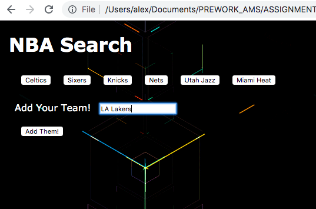
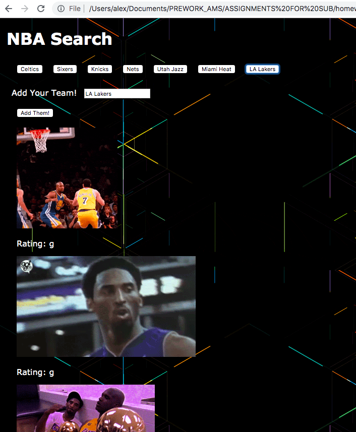

# GifTastic

 

## Problem

GifTastic is a dynamic web page populates with NBA gifs from the GIPHY API. A few suggested teams are listed as buttons at the top and the page.  The user can also add another team or topic by typing it into the form. Gifs can be animated by clicking on their image and paused if clicked agian.

 

## Overview of App Organization

| Path    | Purpose          |
| -------- | -------------- |
| index.html | Contains the interactive web elements |
| assets/js/app.js | Contains API calls and populates the page |
| assets/css/style.css | Contains syling elements |

 

## Run Instructions

For example if the user wanted to see GIFs from the LA Lakers the form could be filled out as seen below.

Then a new button could be produced at the top of the page by clicking the **Add Them!** button.

By clicking the new button the user would see gifs displayed with their rating as seen below.

 

## This App Utilizes

  * [Giphy API](https://developers.giphy.com/docs/)

  * [Bootstrap](https://getbootstrap.com/docs/4.3/getting-started/introduction/)

## Role in Development

My name is Alex I am a bootcamp student whose portfolio can be found
[here.]( https://alexsamalot19.github.io/Samalot-Alexander-Portfolio/)

I designed this app using  an existing API and Bootstrap as listed in the **This App Utilizes** section. I call the GIPHY API and use JavaScript and jQuery to change the HTML of the site. 

